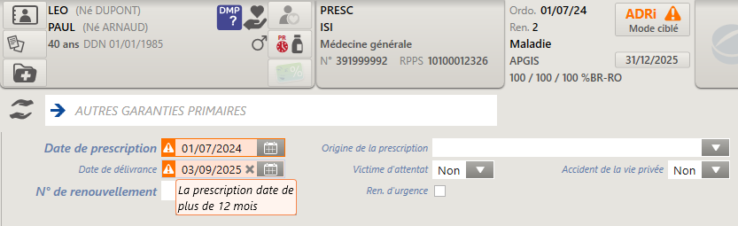

# Délivrer une ordonnance

La délivrance sur ordonnance permet d'enregistrer et de suivre la dispensation de médicaments ou de dispositifs médicaux prescrits par un professionnel de santé. Elle se déroule avec ou sans lecture de la carte Vitale du patient (mode sécurisé ou dégradé).

La carte CPS ou CPE doit être insérée dans le lecteur SESAM-Vitale.

---

## Accéder à la délivrance sur ordonnance

Depuis l’écran d’accueil, saisissez **201** ou _délivrance sur ordonnance_ dans le champ de saisie, puis validez avec **Entrée**.

---

## Déroulement de la délivrance

Les étapes s’affichent dans des **tuiles** accessibles via le bandeau supérieur :

1. [Identifier le patient](/comptoir/actions-generales/identifier-patient)
2. [Sélectionner le prescripteur](/comptoir/actions-generales/selectionner-prescripteur)
3. [Définir la prise en charge](/comptoir/actions-generales/definir-prise-en-charge)
4. [Entrer les produits](/comptoir/actions-generales/saisir-produits)
5. [Facturer la délivrance](/comptoir/actions-generales/facturer)

Tant que la délivrance n’est pas facturée, vous pouvez l’annuler avec le bouton **Abandonner**, puis confirmer par **Oui (O)**.

---

## Bon à savoir

### Effectuer une autre prestation

- Cliquez sur **(F9)** dans le bandeau vertical à gauche, puis choisissez le type de prestation :
  - **Vente directe** :
    - au même patient/assuré → sélectionnez _Vente directe_ et choisissez le patient.
    - sans patient → cliquez sur _ne sélectionner personne_.
    - à un autre patient → sélectionnez _Vente directe (autre panier)_.
  - **Avance produit** ou **Reprise produit** : sélectionnez le patient ou cliquez sur _ne sélectionner personne_.

Chaque nouvelle prestation génère une icône de vente dans le bandeau vertical. L’icône active est signalée par un fond **vert**.

---

### Gérer le message "*des données obligatoires pour la facturation sont manquantes*"

1. Cliquez sur **Oui (Entrée)** dans le message affiché.
2. Complétez les champs obligatoires signalés par le pictogramme :
   - Numéro SIRET
   - Numéro TVA intracommunautaire
   - Code NAF
3. Cliquez sur **Valider (Entrée)** pour enregistrer.
4. Identifiez-vous avec votre identifiant et mot de passe, puis cliquez sur **Valider (Entrée)**.

---

### Contrôler la date de prescription

- Le logiciel vérifie automatiquement la cohérence entre la date de prescription, la date de délivrance et le numéro de renouvellement.
- En cas d’écart, les champs sont surlignés en **orange** et un message d’alerte s’affiche en info-bulle.

